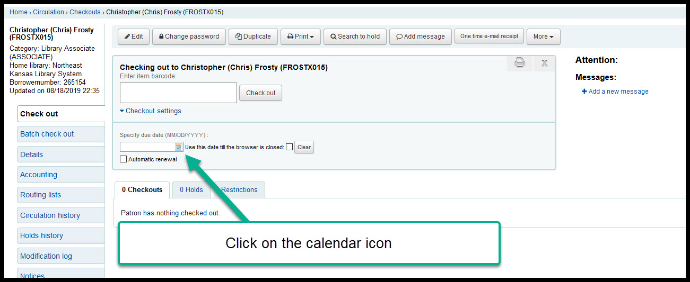
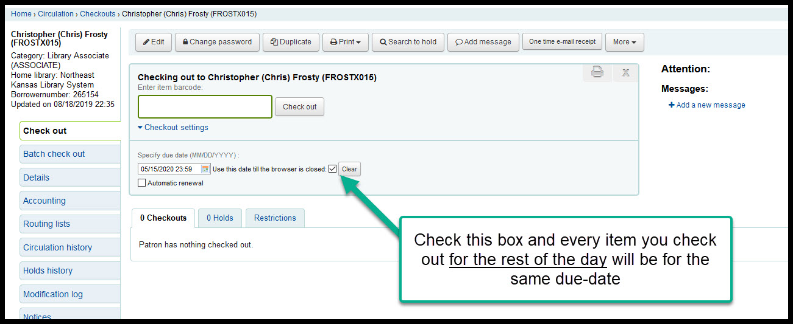
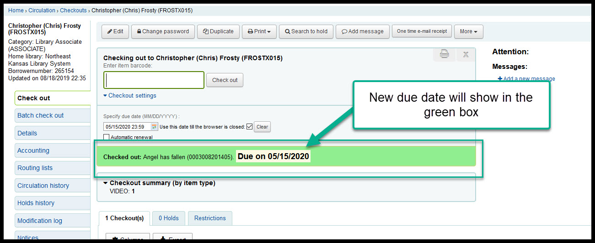

.. # for Parts [/source/]
.. * for Chapters [/source/subfolder/ or source/subfolder/libraryname]
.. = for sections (“Heading 1”) [/souce/pages/]
.. - for subsections (“Heading 2”)
.. ^ for subsubsections (“Heading 3”)
.. " for paragraphs (“Heading 4”)

Modify a due date
-----------------

It is possible to modify the due date on an item before you check the item out to a patron.

1.  From the check-out page in a patron's account, click on the "Checkout settings" option under the input box

.. image:: ../images/modify.duedate.010.jpg

2.  Ignore the "Automtic renewal" checkbox

.. image:: ../images/modify.duedate.020.jpg

3.  Click on the calendar icon and select a new due date

.. image:: ../images/modify.duedate.040.jpg

4.  !OPTIONAL! - Check the "Use this date till the browers is closed" checkbox to set every due date for every patron to the new due date

6.  The new due date will show highlighted in green after each check-out

